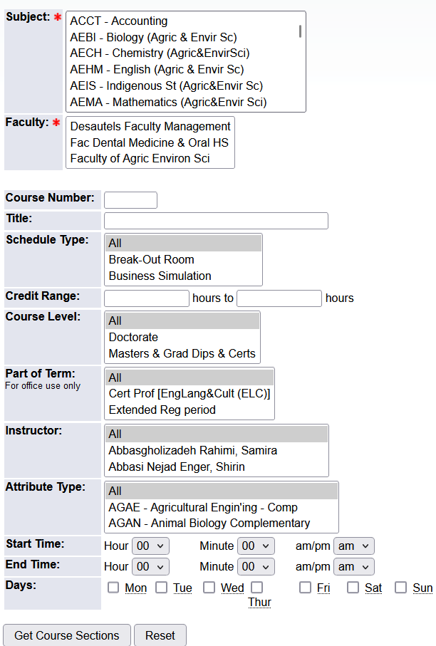
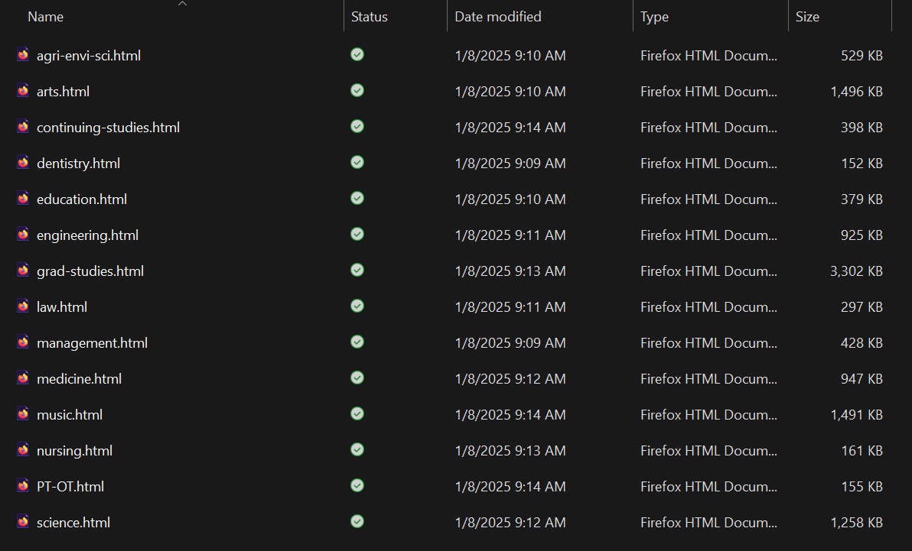

# McGill Classroom Scout

A program for finding empty classrooms to study in at McGill. Using a command-line interface, users can view the schedules of rooms and search for rooms without scheduled classes.

---

### Contents

1. How It Works
2. Getting Started
3. Usage
4. Building or Updating the Database
5. Development

---

### How It Works

- The program builds a database from course registration data downloaded from [Minerva](https://mcgill.service-now.com/itportal?id=kb_article_view&sysparm_article=KB0010779).
- Room schedules and availabilities provided by the program only correspond to vacancies in the course registration schedule. Therefore, it does not account for things such as:
  - Building hours
  - Access restrictions (some rooms such as labs may only be open to certain students)
  - Other activities scheduled outside of Minerva (e.g., meetings, events, and some exams)
- The database must also be properly built and up-to-date.

### Getting Started

1. Install [Python 3](https://www.python.org/downloads/) and the [beautifulsoup4](https://pypi.org/project/beautifulsoup4/) package.
2. Clone or download and unzip the repository.
3. Confirm that "database.json" is included and up to date. If it isn't, you'll need to build the database yourself.
4. Open the directory in which the program is located in your favorite terminal program and run the following command:

```
python classroom_scout.py
```

### Usage

| Command                                | Description                                                  |
| :------------------------------------- | :----------------------------------------------------------- |
| `list`                                 | Lists all valid room codes.                                  |
| `schedule <room code> <date>`          | Returns the schedule for a room on a given day.              |
| `find <date> <start time> <stop time>` | Finds all rooms without classes scheduled during on a particular day during a specified timeframe. |
| `build`                                | Builds the database (see below).                             |
| `exit`                                 | Exits the program.                                           |

##### Notes:

- All arguments should be in quotes.
- Times should be in 12-hour format.
- Dates should be in MM/DD/YY format.
- You can use "today" instead of a date to use the current day.

### Building or Updating the Database

*Database Last Updated: 01/08/2025 (Winter 2025 Term)*

Currently, I am including the database. However, if it's missing or out-of-date, you'll need to rebuild it yourself using the following instructions:

1. Create a folder in the same directory as "classroom_scout.py" called "input".
2. Log in to Minerva and navigate the following menus: Student Menu -> Registration Menu -> Step 2: Search Class Schedule and Add Course Sections.
3. Choose the current term and press "Advanced Search". You should be on the "Look Up Course Sections" page and see the following form: 



4. Select the first faculty and press "Get Course Sections". Save the webpage as a .html file inside of the input folder. Continue to populate the input folder with a .html file for every faculty. In the end, your input folder should look something like this:



5. Run the program and run the command, `build`. If all is good, the file "database.json" should be created or updated.

##### Troubleshooting:

- The input folder needs to be in the same folder as "classroom_scout.py".
- You need to either navigate to this directory in your terminal or launch it inside this directory when you run the program.
- Currently, you can only build a database in the current term. (Specifically, the program is hardcoded to use the current year. You can change this by setting the year variable to something else.)

### Development

##### Currently, the following things need to be done:

- [ ] Fix bugs when parsing course registration data.
- [ ] Add usage examples to the readme.
- [ ] Design more comprehensive tests.

##### It would also be nice to do the following:

- [ ] Automate the fetching of course registration data.
- [ ] Make installation and usage of the program more user-friendly.
- [ ] Factor in building hours, access restrictions, and some known events.


If you're a developer, feel free to help out and/or share your ideas for the direction of this project. Cheers.
